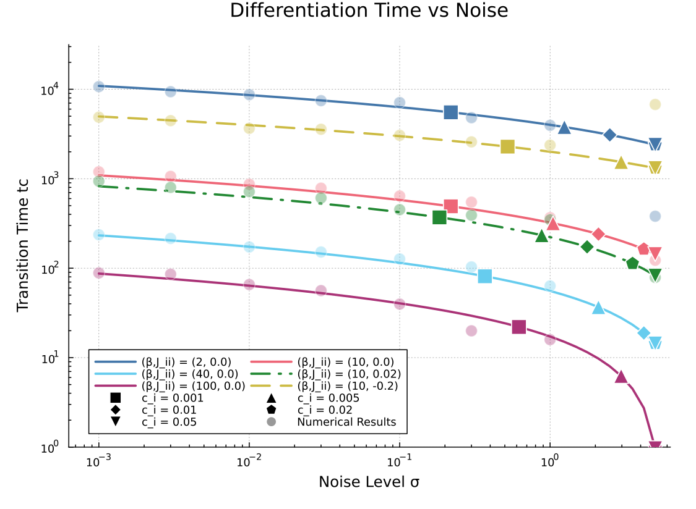
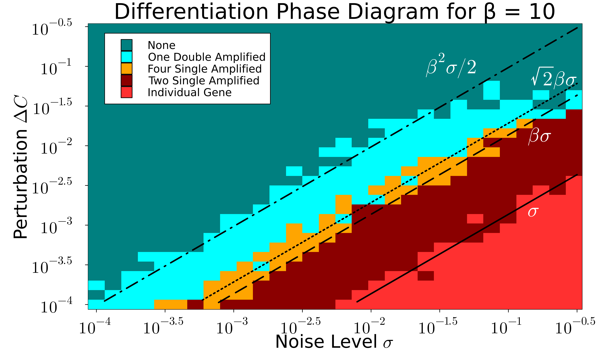
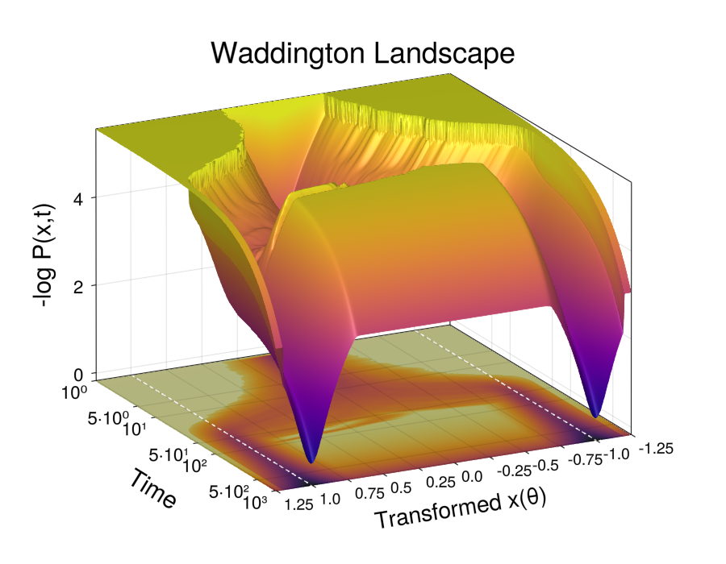
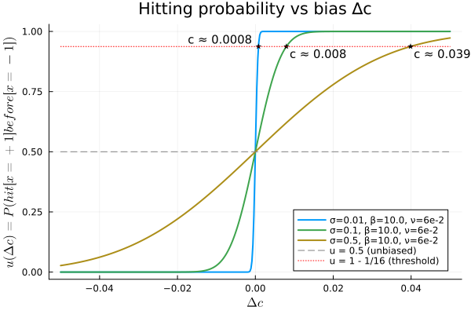
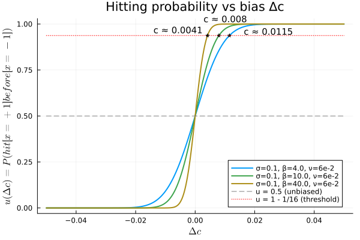
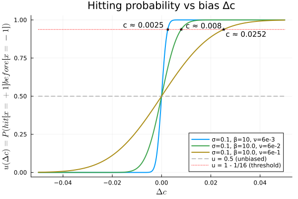

# Noise-Driven Differentiation via Gene Frustration and Epigenetic Fixation

## Abstract

Gene expression levels in cells are inherently stochastic, yet cell differentiation is robust. This work proposes a mechanism based on **frustrated genes**, which exhibit weakly stable intermediate expression levels due to competing regulatory inputs. Stochastic fluctuations enable transitions between basins of attraction, while slow epigenetic fixation stabilizes the final differentiated state. Regulatory interactions amplify effective noise, facilitating differentiation. Analytical expressions for differentiation time, transition probabilities, and phase behavior are derived and validated numerically. The framework provides a dynamical realization of Waddington’s concept of homeorhesis.

---

## Model Overview

The system consists of coupled dynamics for gene expression (x_i) and epigenetic variables (θ_i):

dx_i/dt = Tanh[β( sum_j J_ij x_j + θ_i + c_i )] - x_i + σ_i η_i

dθ_i/dt = ν (x_i - θ_i)

Where:

- J_ij : gene regulatory interactions  
- θ_i  : epigenetic feedback variable  
- c_i  : bias term  
- σ_i  : noise strength 
- β    : Transcription factor
- ν    : epigenetic timescale  
- η_i  : Gaussian white noise term
---

## Key Mechanism

- Frustrated genes reside near unstable intermediate states x_i ≈ 0
- Noise induces transitions between competing attractors
- Epigenetic feedback progressively stabilizes gene expression
- Network interactions amplify effective noise
- Differentiation emerges as a noise-driven yet robust process

---

## Results

### 1. Frustrated Gene Dynamics

This figure illustrates stochastic trajectories of gene expression and epigenetic variables during differentiation.

---

### 2. Differentiation Time vs Parameters

Analytical predictions and numerical simulations of differentiation time under varying noise strength and regulatory parameters.

---

### 3. Phase Diagram of Differentiation

Phase diagram showing regimes of mono- and bistable differentiation outcomes across parameter space.

---

### 4. Waddington Landscape

Reconstructed Waddington landscape illustrating branching differentiation and basin structure over developmental time.

---

## Analytical Bias Dependence

Below are numerical illustrations of the bias-dependent differentiation probability under different parameter variations.

### Effect of Noise Strength

### Effect of Transcription Factor (β)

### Effect of Epigenetic Timescale (ν)

---

## Repository Structure
